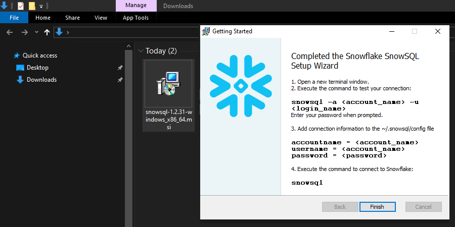
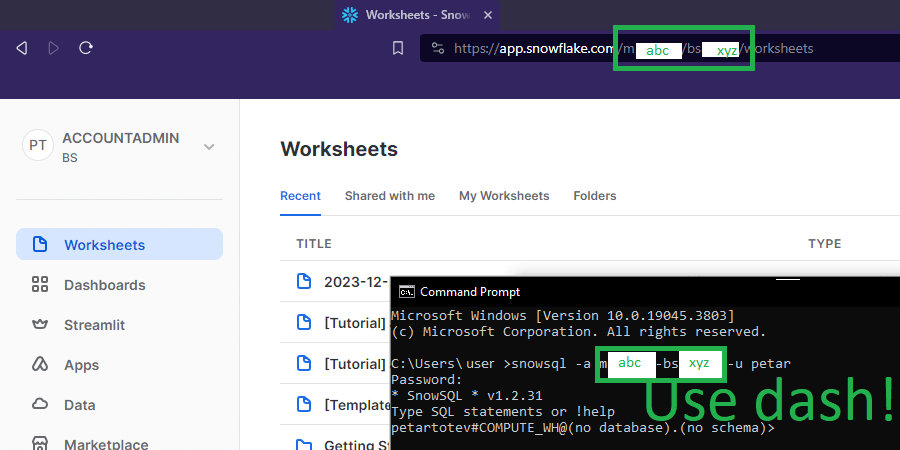
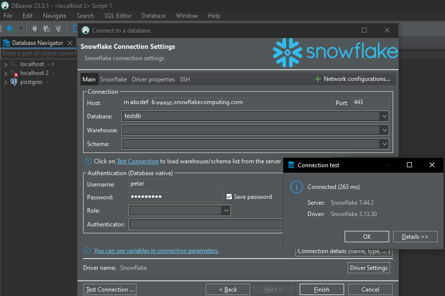

# PT_Demo_Snowflake

Future me, you will find screenshots that can be used as a guide of all steps described below in this README:<br>`cloud > SOFTWARE > Snowflake > Install`.

## Contents
- [Snowflake Setup](#snowflake-setup)
    - [Install SnowSQL](#install-snowsql)
    - [Sign up in Snowflake](#sign-up-in-snowflake)
    - [Connect to SnowSQL](#connect-to-snowsql)
    - [DBeaver Connection Alternative](#dbeaver-connection-alternative)
- [Application Setup](#application-setup)
- [Links](#links)

## Snowflake Setup

### Install SnowSQL

1. Download the latest version of SnowSQL for Windows from [here](https://developers.snowflake.com/snowsql/):

```
snowsql-1.2.31-windows_x86_64.msi
```

2. Install:
- [Next]
- Install Snowflake SnowSQL to: C:\Program Files\Snowflake SnowSQL
- [Install]



### Sign up in Snowflake

3. Go to the [Snowflake website](https://www.snowflake.com/en/) and sign up for a 30-day trial (choose `[START FOR FREE]`):

- Add your personal data:
    - first name
    - last name
    - email
    - username
    - role
    - country
- Choose your Snowflake edition: Enterprise
- Choose your cloud provider: AWS
- EU (Frankfurt)
- [✓] Check here to indicate you read agreement...
- Select your preferred language(s) to work in: SQL

4. Check your email and activate your account by pressing `[CLICK TO ACTIVATE]`

5. The link in the email redirects you to a page in which you have to choose:
- username
- password  
=> [Get started]

### Connect to SnowSQL

6. You will get redirected to Snowflake Worksheets. Mind the URL:

```
https://app.snowflake.com/<orgname>/<account_name>/worksheets
```
Copy the `<orgname>/<account_name>` from the URL (e.g. `m123456/bs12345`) and replace the `\` (backslash) with `-` (dash).

7. Open a command prompt and execute the following command, then enter your password:

```
C:\Users\gosho>snowsql -a m123456-bs12345 -u gosho
Password: your-pass-here
```

Output:
```
* SnowSQL * v1.2.31
Type SQL statements or !help
gosho#COMPUTE_WH@(no database).(no schema)>
```



8. Use the SnowSQL CLI to execute SQL queries:

⚠️ WARNING: Never forget the `;` at the end of a SQL command before executing!

- Show Databases

```
gosho#COMPUTE_WH@(no database).(no schema)>show databases;
```

Output:
```
2 Row(s) produced. Time Elapsed: 0.552s
```

- Create Database testdb

```
gosho#COMPUTE_WH@(no database).(no schema)>create database testdb;
```

Output:
```
+---------------------------------------+
| status                                |
|---------------------------------------|
| Database TESTDB successfully created. |
+---------------------------------------+
1 Row(s) produced. Time Elapsed: 0.551s
```

- Create Table Student

```
gosho#COMPUTE_WH@TESTDB.PUBLIC>CREATE TABLE Student (StudentId INT AUTOINCREMENT PRIMARY KEY, FirstName STRING, LastName STRING, Age INT, Address STRING, City STRING);
```

Output:
```
+-------------------------------------+
| status                              |
|-------------------------------------|
| Table STUDENT successfully created. |
+-------------------------------------+
1 Row(s) produced. Time Elapsed: 0.774s
```

- Insert into Table Student

```
gosho#COMPUTE_WH@TESTDB.PUBLIC>INSERT INTO Student (FirstName, LastName, Age, Address, City) VALUES ('John', 'Doe', 21, '123 Main St', 'Cityville');
```

Output:
```
+-------------------------+
| number of rows inserted |
|-------------------------|
|                       1 |
+-------------------------+
1 Row(s) produced. Time Elapsed: 1.378s
```

- Select all from Table Student

```
gosho#COMPUTE_WH@TESTDB.PUBLIC>SELECT * FROM Student;
```

Output:
```
+-----------+-----------+----------+-----+-------------+-----------+
| STUDENTID | FIRSTNAME | LASTNAME | AGE | ADDRESS     | CITY      |
|-----------+-----------+----------+-----+-------------+-----------|
|         1 | John      | Doe      |  21 | 123 Main St | Cityville |
+-----------+-----------+----------+-----+-------------+-----------+
1 Row(s) produced. Time Elapsed: 0.564s
```

### DBeaver Connection Alternative

Alternatively, you can connect to Snowflake using DBeaver.

1. Do all steps from the [Connect to SnowSQL](#connect-to-snowsql) section in order to have all prerequisites done.

2. Proceed with the following:

- Open DBeaver, go to Database Navigator > Create > Connection
- Select your database: Snowflake
- Driver settings: Download driver files!
- Connect to a database:
    - Connection:
        - Host: /<orgname/>-/<account_name/>.snowflakecomputing.com
        - Port: 443
        - Database: testdb
        - Warehouse: *you can leave empty*
        - Schema: *you can leave empty*
    - Authentication:
        - Username:
        - Password:
        - Role: *you can leave empty*
        - Authenticator: *you can leave empty*
- Click on [Test Connection] => ✅
- [Finish]



3. Create new SQL Script to get all students from Student Table (created in the [previous section](#connect-to-snowsql)):

```
SELECT STUDENTID, FIRSTNAME, LASTNAME, AGE, ADDRESS, CITY
FROM TESTDB."PUBLIC".STUDENT;
```

## Application Setup

1. Create new .NET Solution `PT_Demo_Snowflake` and add a new .NET 6 Web API `Snowflake.WebApi`.

2. Install the following NuGet packages:
- Snowflake.Data (2.0.10)
- System.Data.Odbc (7.0.0)

3. Implement `SnowflakeController.cs` having the following endpoints:
- [HttpGet("password/showdatabases")]
- [HttpGet("password/getallstudents")]
- [HttpGet("dotnetdriver")]
- [HttpGet("odbcdriver")]

## Links
- https://docs.snowflake.com/en/user-guide/organizations-connect#drivers
- https://docs.snowflake.com/en/user-guide/admin-account-identifier
- https://community.snowflake.com/s/question/0D53r0000BlZPP6CQO/error250001-na-could-not-connect-to-snowflake-backend-after-0-attemptsaborting